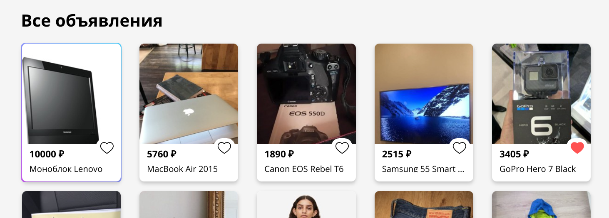

# Отчет о тестировании веб-приложения для продажи подержаных вещей ["Волчок"](https://www.vol-4-ok.ru)

## Сессия тестирования 24.09.2024 21:46

### Общие данные

- Место проведения тестирования: Google Chrome Версия 128.0.6613.84 (Официальная сборка), (64 бит)
- Дата проведения тестирования: 24.09.2024
- Продолжительность тестирования: 1:30

### 1. Страница объявления
#### 1.1. Контейнер "пути до объявления"
**В контейнере содержатся информация о городе, в котором выставлен товар, категории товара и названии товара.**

1. Клик по ссылке с названием категории приводит к перемещению на страницу с товарами данной категории
2. Клик по ссылке с названием города приводит к перемещению на страницу с товарами из данного города

#### 1.2. Карточка товара
**На карточке расположены информация о товаре (название, описание, цена, категория, местоположение, состояние, дата размещения товара, количество просмоторов и добавлений в избранное); карусель с изображениями товара; блок с историей изменения цены а также иконка сердца и подпись к ней. Для автора объявления присутствует кнопка для редактирования.**

 1. Подсвечивается иконка сердца при наведении курсора
 2. Надпись "Добавить в избранное" выделяется подчеркиванием при наведении курсора
 3. Кнопки со стрелочками на карусели изображений приобретают тень при наведении курсора
 4. Наведение на блок с историей изменения цены меняет цвет фона на серый
 5. Надпись "Редактировать объявление" выделяется подчеркиванием при наведении курсора
 6. Наведение на оставшиеся элементы не дает визуальной обратной связи
 7. При клике на иконку сердца на ней появляется красная заливка и воникает поп-ап с сообщением, что товар добавлен в избранное. Текст рядом с кнопкой меняется на "Удалить из избранного"
 8. Если товар уже был добавлен в избранное (при повторном клике), заливка снимается и появляется поп-ап с обратным сообщением, что товар удален из избранного. Текст рядом с кнопкой меняется на "Добавить в избранное"
 9. При клике на кнопку без наличия авторизация на сайте воозникает окно с предложением войти в аккаунт
 10. Клик на кнопку ">" вызывает увеличение размера стрелочки на кнопке, а также меняет цвет фона на серый на небольшой промежуток времени. Скрывается крайняя левая фотография на карусели и вместо нее появляется та часть, которая была скрыта справа
 11. Если при нажатии кнопки ">" уже была открыта часть крайней правой фотографии, то она открывается целиком, крайняя левая фотография при этом скрывается лишь частично
 12. Если в момент нажатия кнопки ">" уже была достигнута крайняя правая фотография, карусель смещается на начальную позицию, показывая все вмещающиеся изображения, начиная с первой фотографии
 13. Клик на кнопку "<" вызывает увеличение размера стрелочки на кнопке, а также меняет цвет фона на серый на небольшой промежуток времени. Скрывается крайняя правая фотография на карусели и вместо нее появляется та часть, которая была скрыта слева
 14. Если при нажатии кнопки "<" уже была открыта часть крайней левой фотографии, то она открывается целиком, крайняя правая фотография при этом скрывается лишь частично
 15. Если в момент нажатия кнопки "<" уже была достигнута крайняя левая фотография, карусель смещается на конечную позицию, показывая все вмещающиеся изображения, заканчивая последней фотографией
     + Баг: множественные нажатия на кнопки со стрелочками вызывают подергивания изображений
 16. Клик на блок с историей изменения цены приводит к появлению диалогового окна с подробной информацией
 17. Нажатие на кнопку "Редактировать объявление" приводит к переходу на форму редактирования объявления

#### 1.3. Блок с функциональными кнопками
**В данном блоке содержатся кнопка добавления в корзину для покупателя. Автор объявления увидит кнопки продвижения объявления, снятия его с продажи и информацию о тарифе (название тарифа, оставшееся время и прогрес-бар), если объявление уже продвинуто.**

1. Кнопка "Добавить в корзину" меняет оттенок при наведении
2. Кнопка "Снять с продажи" меняет оттенок при наведении
3. Кнопка "Провдинуть объявление" меняет прозрачность при наведении
4. Нажатие на кнопку "Добавить в корзину" приводит к появлению диалогового окна с предложением перейти в корзину. Надпись на кнопке меняется на "Удалить из корзины"
    + Баг: наведение на надпись на кнопке "В корзину" в диалоговом окне приводит к смене курсора на курсор формы ввода
    + Баг: наведение на надпись на кнопке "Отмена" в диалоговом окне приводит к смене курсора на курсор формы ввода
5. Нажатие на кнопку "Удалить из корзины" приводит к появлению диалогового окна с предложением перейти в корзину. Надпись на кнопке меняется на "Добавить в корзину"
6. Нажатие на кнопку "Снять с продажи" приводит к закрытию страницы объявления
7. Нажатие на кнопку "Продвинуть объявление" приводит к появлению диалогового окна с выбором тарифа

#### 1.4. Карточка продавца
**Карточка продавца содержит информацию о продавце (имя, автарку, город, дату регистрации), его рейтинг, количество отзывов, подписчиков и подписок.**

1. Текст с именем продавца меняет прозрачность при наведении
2. Текст, отображающий количество отзывов, выделяется подчеркиванием при наведении
3. Текст, отображающий количество подписчиков, выделяется подчеркиванием при наведении
4. Текст, отображающий количество подписок, выделяется подчеркиванием при наведении
5. Кнопка "Подписаться" меняет прозрачность при наведении
6. Наведение на оставшиеся элементы не дает визуальной обратной связи
7. Нажатие на кнопку "Подписаться" приводит к изменению надписи на кнопке на "Отписаться". Также возникает поп-ап с соответствующим сообщением
    + Баг: нажатие на кнопку не меняет количество подписчиков у продавца
8. Если уже была оформлена подписка, то нажатие на кнопку "Отписаться" приводит к изменению надписи на кнопке на "Подписаться". Также возникает поп-ап с соответствующим сообщением
9. Нажатие на имя продавца приводит к переходу на его страницу

#### 1.5. Диалоговое окно с историей изменения цены
**В данном диалоговом окне содержится график изменения цены, указан диапазон цен и времени изменения, а также текущая цена товара.**

1. Наведение на график приводит к появлению поп-апа с датой выставления цены и самой ценой. Также на графике в месте, ближайшем к курсору, в момент наведения появляется точка
2. Наведение на оставшиеся элементы не дает визуальной обратной связи
3. Клик по кнопке с крестиком приводит к закрытию диалогового окна
4. Клик вне диалога приводит к закрытию диалогового окна

#### 1.6. Диалоговое окно с выбором тарифа
**Данное диалоговое окно доступно только для продавца, который еще не продвинул свое объявление. В нем содержится информация о возможных тарифах (стоимость, описание, срок действия) и кнопка оплаты.**

1. Наведение на элементы не дает визуальной обратной связи
2. Клик по кнопке с крестиком приводит к закрытию диалогового окна
3. Клик вне диалога приводит к закрытию диалогового окна
4. Клик по конкретному тарифу приводит к тому, что карточка этого тарифа приобретает синюю рамку и светло-голубой фон. Надпись на кнопке оплаты изменяется на стоимость тарифа. Также над карточкой в левом углу появляется точка активной радиокнопки
5. Клик по кнопке продвижения приводит к переходу на форму оплаты и закрытие страницы. Если оплата не была произведена, то на месте кнопки продвижения объявления в функциональном блоке появится надпись "Платеж в обработке" и спиннер

### Заключение

При тестировании были обнаружены визуальные баги и баги среднего приоритета. Общее состояние и функциональность страницы объявления можно оценить как хорошее.

### Подпись: [Илья Чугин](https://github.com/IlyaChgn)

## Сессия тестирования 25.09.2024 21:19

### Общие данные

- Место проведения тестирования: Google Chrome Версия 128.0.6613.84 (Официальная сборка), (64 бит)
- Дата проведения тестирования: 25.09.2024
- Продолжительность тестирования: 3:11

### 2. Профиль пользователя
#### 2.1. Карточка профиля
**В карточке профиля расположены имя профиля, его аватар, рейтинг, количество отзывов, подписок и подписчиков, дата регистрации и город.**

1. Текст, отображающий количество отзывов, выделяется подчеркиванием при наведении
2. Текст, отображающий количество подписчиков, выделяется подчеркиванием при наведении
3. Текст, отображающий количество подписок, выделяется подчеркиванием при наведении
4. Кнопка "Подписаться" окрашивается в более светлый цвет при наведении
5. При наведении на имя пользователя курсор превращается в указательный палец и текст имени становится более светлым. При клике на имя пользователя происходит редирект на тут же страницу, на который пользователь сейчас находится
6. Наведение на оставшиеся элементы не дает визуальной обратной связи
7. Рейтинг продавца обновляется, если пользователь, купивший товар данного продавца, оставляет свою оценку к нему
8. После добавления оценки также увеличивается количество отзывов
9. Количество подписчиков увеличивается, если на данный профиль оформляет подписку другой пользователь
10. Количество подписок увеличивается, если пользователь оформляет подписку на другого продавца
11. Если пользователь не загрузил аватар, то вместо него будет отображаться стандартный аватар
12. Если у пользователя не задано имя профиля, то вместо имени будет отображаться подпись "Пользователь № <порядковый номер пользователя>"
13. В качестве города отображается город, указанные в профиле пользователя
14. В качестве даты регистрации отображается дата регистрации 

#### 2.2. Контейнер с разделами профиля
**В данном контейнере содержатся кнопки для осуществления навигации по профилю: "Мои объявления", "Мои заказы", "Избранное", "Настройки".**

1. Надпись на кнопке "Мои объявления" меняет цвет на голубой при наведении, если она до этого не была активна. Также меняется цвет пиктограммы со списком, расположенной слева от надписи
2. Надпись на кнопке "Мои заказы" меняет цвет на голубой при наведении, если она до этого не была активна. Также меняется цвет пиктограммы с коробкой, расположенной слева от надписи
3. Надпись на кнопке "Избранное" меняет цвет на голубой при наведении, если она до этого не была активна. Также меняется цвет пиктограммы с сердцем, расположенной слева от надписи
4. Надпись на кнопке "Настройки" меняет цвет на голубой при наведении, если она до этого не была активна. Также меняется цвет пиктограммы с шестеренкой, расположенной слева от надписи
5. Клик по кнопке "Мои объявления" приводит к переходу на страницу со списком объявлений пользователя, если она была неактивна. При этом надпись и пиктограмма рядом с ней меняют цвет на голубой
6. Клик по кнопке "Мои заказы" приводит к переходу на страницу со списком заказов пользователя, если она была неактивна. При этом надпись и пиктограмма рядом с ней меняют цвет на голубой
7. Клик по кнопке "Избранное" приводит к переходу на страницу с избранными объявлениями пользователя, если она была неактивна. При этом надпись и пиктограмма рядом с ней меняют цвет на голубой
8. Клик по кнопке "Настройки" приводит к переходу на страницу с настройками профиля пользователя, если она была неактивна. При этом надпись и пиктограмма рядом с ней меняют цвет на голубой

#### 2.3. Раздел со списком объявлений
**В данном разделе расположены секции с проданными и активными объявлениями. В каждой секции находится список с карточками товара.**

1. При наведении на карточку товара происходит расширение области тени вокруг нее
2. При движении мыши по блоку с фотографией на карточке товара происходит переключение фотографий
3. Наведение на другие элементы контейнера не дает визуального отклика
4. Клик по карточке товара приводит к переходу на страницу с товаром
5. Клик по кнопке "Активные" приводит к переходу на секцию с активными объявлениями, если она не была открыта. Также подчеркивание под текстом приобретает голубой цвет
6. Клик по кнопке "Проданные" приводит к переходу на секцию с проданными объявлениями, если она не была открыта. Также подчеркивание под текстом приобретает голубой цвет
7. При создании нового объявления карточка с данным товаром появляется на вкладке "Активные", а счетчик активных объявлений на вкладке увеличивается
8. При покупке объявления данного продавца карточка с купленным товаром появляется на вкладке "Проданные" и исчезает с вкладки "Активные". При этом счетчик активных объявлений на вкладке уменьшается, а счетчик проданных - увеличивается
9. Если у пользователя нет активных объявлений, то вместо списка будет показано изображение с пустыми карточками товара, под ним будет располагаться соответствующая подпись. Счетчик объявлений на вкладке при этом будет показывать 0
10. Если у пользователя нет проданных объявлений, то вместо списка будет показано изображение с пустыми карточками товара, под ним будет располагаться соответствующая подпись. Счетчик объявлений на вкладке при этом будет показывать 0

#### 2.4. Раздел со списком заказов
**В данном разделе располагаются секции с купленными и проданными пользователем товарами, в каждой секции отображается список заказов, если таковые имеются.**

1. Наведение на элементы интерфейса не дает визуального отклика
2. Клик по кнопке "Покупки" приводит к переходу на секцию с оформленными заказами, если она не была открыта. Также подчеркивание под текстом приобретает голубой цвет
3. Клик по кнопке "Продажи" приводит к переходу на секцию с заказами других пользователей, если она не была открыта. Также подчеркивание под текстом приобретает голубой цвет
4. Если у пользователя нет активных заказов, то вместо списка будет показано изображение с пустыми карточками заказа, под ним будет располагаться соответствующая подпись
5. Если у пользователя нет заказов, оформленных другими пользователями, то вместо списка заказов будет показано изображение с пустыми карточками заказа, под ним будет располагаться соответствующая подпись

#### 2.5. Карточка заказа
**На карточке заказа присутствует информация о заказе, а именно его стоимость, статус, имя получателя, фотография товара, телефон, адрес доставки и рейтинг заказа.**

1. Если заказ был оформлен данным пользователем, но не был оценен, то наведение на пиктограмму звезды под заказом приведет к заливке желтым цветом текущей и всех предшествующих звезд
2. Наведение на другие элементы интерфейса не дает визуального отклика 
3. При клике на пиктограмму звезды под активным заказом произойдет заливка текущей и предыдущих звезд желтым цветом, рядом с ними появится число выставленных звезд, а сама строка с рейтингом сместится вниз. Элемент при этом перестанет быть активным
4. У автора объявления в списке проданных заказов будут отображаться звезды без заливки и указания рейтинга, если заказ еще не был оценен
    + Баг: вместо имени получателя в карточке отображается пустое поле
    + Баг: вместо телефона получателя в карточке отображается надпись "Сохранить"
    + Баг: вместо адреса получателя в карточке отображется номер телефона
    + Баг: отступ строки с рейтингом у заказа без оценки будет больше, чем у закза с оценкой

#### 2.6. Раздел с избранными объявлениями
**В данном разделе есть секции с избранными объявлениями и объявлениями продавцов, на которых оформлена подписка. В каждой секции присутствуют карточки товара.**

1. При наведении на карточку товара происходит расширение области тени вокруг нее
2. При движении мыши по блоку с фотографией на карточке товара проихслдит переключение фотографий
3. Наведение на другие элементы контейнера не дает визуального отклика
4. Клик по кнопке "Избранное" приводит к переходу на секцию с избранными объявлениями пользователя, если она не была открыта. Также подчеркивание под текстом приобретает голубой цвет
5. Клик по кнопке "Подписки" приводит к переходу на секцию с объявлениями от продавцов, на которых офрмлена подписка, если она не была открыта. Также подчеркивание под текстом приобретает голубой цвет
6. После оформления подписки на продавца список его объявлений будет отображаться в секции "Подписки"
7. Заказ, добавленный в избранное, будет отображаться на вкладке "Избранное"
8. Если у пользователя нет избранных объявлений, то вместо списка будет показано изображение с пустыми карточками товара, под ним будет располагаться соответствующая подпись
9. Если у пользователя нет подписок на других продавцов, то вместо списка будет показано изображение с пустыми карточками товара, под ним будет располагаться соответствующая подпись

#### 2.7. Раздел с настройками профиля
**В данном разделе располагаются настройки профиля пользователя, а именно настройки почты, телефона, города и общих данных профиля.**

1. Наведение на элементы интерфейса не дает визуального отклика
2. Клик по кнопке "Редактировать" в секции редактирования профиля приведет к открытию соответствующего диалогового окна
3. Если у пользователя не заданы имя и фамилия в профиле, то вместо кнопки "Редактировать" будет отображаться кнопка "Указать", а вместо имени - текст с предложением добвить ФИ. Клик по этой кнопке также приведет к открытию диалогового окна редактирования данных
    + Баг: кнопка "Указать" выравнивается по центру блока, а не по правому краю контейнера
    + Баг: текст с предложением редактирования профиля переносится на вторую строчку блока
4. Клик по кнопке "Редактировать" в секции редактирования телефона приведет к открытию соответствующего диалогового окна
5. Если у пользователя не задан номер телефона в профиле, то вместо кнопки "Редактировать" будет отображаться кнопка "Указать", а вместо номера телефона - текст с предложением добавить его. Клик по этой кнопке также приведет к открытию диалогового окна редактирования телефона
6. Клик по кнопке "Редактировать" в секции редактирования почты приведет к открытию соответствующего диалогового окна
7. Клик по кнопке "Редактировать" в секции редактирования города приведет к открытию соответствующего диалогового окна. По умолчанию отображается город Москва

#### 2.8. Диалоговое окно редактирования профиля
**В диалоговом окне содержится поле редактирования аватара, имени и фамилии пользователя.**

1. При наведении на пиктограмму карандаша в поле загрузки фотографии происходит смена фона пиктограммы на серый
2. Наведение на другие элементы окна не дает визуальной обратной связи
3. Клик по кнопке с крестиком приводит к закрытию диалогового окна
4. Клик вне диалога приводит к закрытию диалогового окна
5. Инпут с именем заполняется именем пользователя, если оно уже было указано
6. В случае, если имя не было указано, будет отображаться плейсхолдер "Имя"
7. Инпут с фамилией заполняется фамилией пользователя, если она уже была указана
8. В случае, если фамилия не была указана, будет отображаться плейсхолдер "Фамилия"
7. Инпут с загрузкой автара заполняется текущим автаром пользователя, если он уже был загружен
8. В случае, если аватар не была загружен, будет отображаться плейсхолдер с дефолтным аватаром
9. Клик по пиктограмме карандаша позволит загрузить аватар пользователя с компьютера. После загрузки аватар будет отображаться вместе предыдущего варианта
10. В инпут с аватаром можно загрузить только форматы png, jpg, jpeg
11. Если добавить в поле имени или фамилии любые символы кроме букв, то в нижней части формы появится соответствующее оповещение, а сохранение не будет произведено
12. Если пропустить инпут с именем или фамилие, при попытке сохранения данных появляется поп-ап с сообщением о необходимости заполнить поля
13. При нажатии кнопки "Сохранить" происходи закрытие диалог, а в профиле появляется аватар пользователя, если он был указан, его имя и фамилия

#### 2.9. Диалоговое окно изменения телефона
**В данном окне представлена форма редактирования номера телефона пользователя.**

1. Наведение на элементы окна не дает визуального отклика
2. Клик по кнопке с крестиком приводит к закрытию диалогового окна
3. Клик вне диалога приводит к закрытию диалогового окна
4. Инпут с именем телефона заполняется ранее введенными данными
5. На инпут телефона действует маска с форматом номера телефона: 
    1) При попытке ввести номер длиннее допустимого, ввод символов прекращается при достижении заданной длины
    2) При попытке ввести символы, не являющиеся цифрами, ввод не фиксируется

#### 2.10. Диалоговое окно изменения почты
**В данном окне представлена форма редактирования электронной почты пользователя.**

1. Наведение на элементы окна не дает визуального отклика
2. Клик по кнопке с крестиком приводит к закрытию диалогового окна
3. Клик вне диалога приводит к закрытию диалогового окна
4. Инпут с почтой заполняется почтой, которая привзана к профилю
5. При вводе некорректного по формату адреса электронной почты, во время изменения почты появляется поп-ап с сообщением о неверном формате почты
6. Если пропустить инпут формы, при попытке изменения почты появляется поп-ап с сообщением о необходимости заполнить все поля

#### 2.11. Диалоговое окно изменения города профиля
**В данном окне представлен селект со списком доступных городов.**

1. Наведение на элементы окна не дает визуального отклика
2. Клик по кнопке с крестиком приводит к закрытию диалогового окна
3. Клик вне диалога приводит к закрытию диалогового окна
4. В селекте выбирается город, который указал пользователь в профиль
5. Если пользователь не указывал город, то город по умолчанию - Москва
6. При клике на селект происходит раскрытие дропдауна с городами и поиском
7. При вводе текста в строку поиска будет выводиться список городов, который содержит данное буквосочетание, в алфавитном порядке

### Заключение

При тестировании были обнаружены визуальные баги и баги среднего приоритета. Общее состояние и функциональность страницы профиля можно оценить как хорошее.

### Подпись: [Илья Чугин](https://github.com/IlyaChgn)

## Сессия тестирования 23.09.2024 23:18

### Общие данные

- Место проведения тестирования: «Яндекс Браузер» 24.7.1.1120 stable (64-bit)
- Дата проведения тестирования: 23.09.2024
- Продолжительность тестирования: 01:32

### 3. [Корзина](https://www.vol-4-ok.ru/cart)
**Раздел корзины доступен только авторизованному пользователю. Если на страницу корзины перейдёт неавторизованный пользователь, то произойдёт редирект на страницу авторизации**
#### 3.1. Карточка товара в корзине
**На карточке расположены чекбокс выбора товара, изображение и название товара, цена, иконка сердца и мусорной корзины.**

1. Подсвечивается чекбокс при наведении курсора;

2. Подсвечивается название при наведении курсора;

3. Подсвечивается иконка сердца при наведении курсора;

4. Подсвечивается красным иконка мусорной корзины при наведении курсора;

5. Наведение на оставшиеся элементы карточки не дает визуальной обратной связи;
6. Если чекбокс активен, то при клике он снимается;
7. Если чекбокс не активен, то при клике он выставляет;

8. При клике на название товара осуществляется переход на страницу этого товара;
9. Если объявление не находится в избранном, то при клике на иконку сердца на нём появляется красная заливка и поп-ап с сообщением, что товар добавлен в избранное;

10. Если товар уже был добавлен в избранное (при повторном клике), заливка снимается и появляется поп-ап с сообщением, что товар удален из избранного;

    + Баг: при переходе на страницу корзины (или обновлении страницы) отсутствует красная заливка иконки сердца, если товар из корзины присутствует в избранном.
11. При клике на иконку мусорной корзины товар удаляется из корзины (карточка пропадает).

#### 3.2. Контейнер для карточек
**Над контейнером расположен заголовок "Корзина" и рядом цифра, обозначающая количество товаров в корзине. Внутри самого контейнера помимо карточек присутствует чекбокс с подписью "Выбрать всё", а также ссылка "Удалить выбранное".**

1. Подсвечивается чекбокс при наведении курсора;

2. Подсвечивается ссылка при наведении курсора;

3. Наведение на оставшиеся элементы не дает визуальной обратной связи;
4. При клике на чекбокс он снимается. При этом снимаются чекбоксы со всех товаров;
5. Если сняты чекбоксы со всех товаров, при клике на чекбокс "Выбрать всё" выставляются чекбоксы на всех карточках и сам чекбокс "Выбрать всё";
6. Если снят чекбокс хотя бы с одного товара, при клике на чекбокс "Выбрать всё" выставляются чекбоксы на всех карточках и сам чекбокс "Выбрать всё";
7. Чекбокс "Выбрать всё" выставляется автоматически, если выбрать все чекбоксы, на всех карточках в корзине;
8. Чекбокс "Выбрать всё" снимается автоматически, если чекбокс, хотя бы с одной карточки в корзине;
9. При клике на ссылку "Удалить выбранное" удалятся все карточки, отмеченные чекбоксами;
10. Если не выбран ни один чекбокс, то при клике на ссылку "Удалить выбранное" реакция отсутствует;
11. Если выбраны все чекбоксы, то при клике на ссылку "Удалить выбранное" все карточки удалятся, а в контейнере появится плейсхолдер с сообщением, что корзина пуста;
    + Баг: размер контейнера с карточками отличается по ширине от размеров контейнера с плейсхолдером.
    + Баг: если нажать на "Удалить выбранное" на пустой корзине, плейсхолдер в контейнере дублируется.
    
12. При удалении карточек цифра, показывающая их количество, уменьшается на количество удалённых карточек.

#### 3.3. Блок оформления заказа
**В блоке присутствует количество товаров, суммарная цена всех товаров и кнопка "Оформить доставку".**

1. Подсвечивается кнопка "Оформить доставку" при наведении курсора;

2. Наведение на оставшиеся элементы не дает визуальной обратной связи;
3. При удалении товаров из корзины счетчик товаров и суммарная цена уменьшаются на количество удалённых товаров и их суммарную цену соответственно;
    + Баг: выбранные товары (отмеченные чекбоксами) никак не влияют на количество товаров и их суммарную цену. Всегда отображается количество и суммарная цена на все товары, находящиеся в корзине.
4. При клике на кнопку "Оформить доставку" осуществляется переход на страницу заказа для тех товаров, которые были отсечены чекбоксами;
5. Если не выбран ни один товар, то при клике на кнопку "Оформить доставку" осуществляется редирект обратно в корзину.

#### 3.4 Критические баги
1. Если товар, находящийся в корзине, куплен другим пользователем, он всё ещё остаётся в корзине у текущего пользователя, и появляется возможность оформить заказ повторно.

### Заключение

При тестировании были обнаружены визуальные баги, баги среднего приоритета, а так же один критический баг. Общее состояние и функциональность страницы корзины можно оценить как требующее доработки.

### Подпись: [Алексей Оглоблин](https://github.com/AlexeiLDD)

## Сессия тестирования 24.09.2024 12:30

### Общие данные

- Место проведения тестирования: «Яндекс Браузер» 24.7.1.1120 stable (64-bit)
- Дата проведения тестирования: 24.09.2024
- Продолжительность тестирования: 00:43

### 4. [Оформление заказа](https://www.vol-4-ok.ru/order)
**Раздел оформления заказа доступен только авторизованному пользователю. Если на страницу оформления заказа перейдёт неавторизованный пользователь, то произойдёт редирект на страницу авторизации**
#### 4.1. Карточка заказов
**На каждый товар оформляется отдельный заказ. На карточке присутствует порядковый номер заказа, название товара, цена товара, цена за доставку и иконка мусорной корзины.**

    + Баг: если на странице не будет ни одного заказа, то мы останемся на странице оформления заказа, где всё ещё будет возможность оформить доставку на "нулевой заказ".
    
1. Подсвечивается красным иконка мусорной корзины при наведении курсора;

2. Наведение на оставшиеся элементы карточки не дает визуальной обратной связи;
3. При клике на иконку мусорной корзины заказ удаляется (карточка пропадает).
    + Баг: при удалении заказа не меняются порядковые номера остальных заказов.
    

#### 4.2. Форма получателя
**В форме получателя присутствуют инпуты для ввода ФИО, телефона,электронной  почты и адреса**

1. Инпут почты автоматически заполняется почтой, введенной при регистрации;
2. Если в профиле заполнен телефон, то инпут телефона автоматически им заполняется;
    + Баг: инпут ФИО не заполняется автоматически, даже если ФИО указаны в профиле;
3. На инпут телефона действует маска с форматом номера телефона: 
    1) При попытке ввести номер длиннее допустимого, ввод символов прекращается при достижении заданной длины;
    2) При попытке ввести символы, не являющиеся цифрами, ввод не фиксируется;
    + Баг: возможно оформить доставку, если ввести номер телефона длиной меньше необходимой.
4. При вводе некорректного по формату адреса электронной почты, при попытке оформления заказа, появляется поп-ап с сообщением о неверном формате почты;

5. Если пропустить один или более из инпутов формы, при попытке оформления заказа, фокус перейдёт на первый незаполненный инпут;

#### 4.3. Блок оформления заказа
**Аналогичен блоку из корзины. В блоке присутствует количество товаров (заказов), суммарная цена всех товаров с учетом доставки и кнопка "Оформить доставку".**

1. Подсвечивается кнопка "Оформить доставку" при наведении курсора;

2. Наведение на оставшиеся элементы не дает визуальной обратной связи;
3. При удалении заказа счетчик товаров уменьшается на один, суммарная цена уменьшаются цену заказа с учетом доставки;
4. При клике на кнопку "Оформить доставку" осуществляется переход на раздел заказов на странице профиля;
5. Если [форма получателя](#42-форма-получателя) заполнена некорректно, то при клике на кнопку "Оформить доставку" на форме получателя появится поп-ап с соответствующим уведомлением.

### Заключение

При тестировании были обнаружены баги среднего приоритета и баги высокого приоритета. Страница функциональна, но содержит серьёзные уязвимости, которые могут сказаться на опыте пользователя.

### Подпись: [Алексей Оглоблин](https://github.com/AlexeiLDD)

## Сессия тестирования 24.09.2024 17:50

### Общие данные

- Место проведения тестирования: «Яндекс Браузер» 24.7.1.1120 stable (64-bit)
- Дата проведения тестирования: 24.09.2024
- Продолжительность тестирования: 01:12

### 5. [Размещение объявления](https://www.vol-4-ok.ru/create)
**Страница представляет из себя форму для размещения нового объявления.**

#### 5.1. форма размещения объявления
**В форме присутствуют дропдауны для выбора категории товара и состояния товара, инпуты названия товара, цены, описания и телефона, селект местоположения, а также кнопки для загрузки фотографии и размещения объявления.**
1. Форма не отправляется, если не заполнен хотя бы один элемент ввода (инпуты, дропдауны, селект);
2. Ввод символов в инпут названия прекращается при достижении 70 символов;
3. Ввод любых символов кроме цифр в инпут цены не считывается;
4. Форма не отправляется, если в инпуте цены значение меньше или равно 0, при этом под инпутом появляется тултип, что значение должно быть больше 0.

5. Форма не отправляется, если в инпуте цены значение больше 10_000_000, при этом под инпутом появляется тултип, что значение должно быть меньше или равно 10_000_000.

6. Ввод символов в инпут описания прекращается при достижении 3000 символов;
7. По умолчанию в селект города подставляется город, определённый по геолокации или выбору пользователя;
8. Если не разрешено определить геолокацию или это не возможно, то по умолчанию для селекта города устанавливается Москва;
9. При клике на селект происходит раскрытие дропдауна с городами и поиском;
10. При вводе текста в строку поиска будет выводиться список городов, который содержит данное буквосочетание, в алфавитном порядке;
11. Если в профиле заполнен телефон, то инпут телефона автоматически им заполняется;
12. На инпут телефона действует маска с форматом номера телефона: 
    1) При попытке ввести номер, длиннее допустимого, ввод символов прекращается при достижении заданной длины;
    2) При попытке ввести символы, не являющиеся цифрами, ввод не фиксируется;
    + Баг: возможно разместить объявление, если ввести номер телефона длиной меньше необходимой.

#### 5.2. Секция загрузки фотографий объявления
**Секция предстваляет из себя кнопку "Добавить". Допускается загрузка не более 10 изображений в форматах JPG или PNG.**

1. Кнопка подсвечивается при наведении курсора;

2. При клике на кнопку открывается модальное окно загрузки файла;
3. Нельзя выбрать сразу несколько файлов, возможен выбор одного единственного файла;
4. При выборе изображения в формате JPG или PNG кнопка сдвигается, на её месте появляется превью изображения;

5. На превью изображения присутствует иконка крестика. При клике на него превью фото удаляется;
6. При добавлении последующих изображений кнопка сдвигается и на её месте появляется превью новго изображения. Превью предыдущих изображений сохраняется;

7. При добавлении десятого изображения кнопка "Добавить" пропадает;

    + Баг: кнопка "Добавить" не появляетя, при удалении любого из десяти изображений;
    
8. При попытке добавить файл в формате не JPG или PNG на месте превью появляется сообщение о недопустимом формате;

9. Форма не отправляется, если присутствует сообщение о недопустимом формате;
10. Форма не отправляется, если не добавлено ни одного изображения, при этом под кнопкой загрузки появляется сообщение с просьбой добавить хотя бы одно фото.

### Заключение

При тестировании были обнаружены баги среднего приоритета. Страница функциональна и не содержит серьёзных уязвимостей.

### Подпись: [Алексей Оглоблин](https://github.com/AlexeiLDD)

## Сессия тестирования 27.09.2024 19:47

### Общие данные

- Место проведения тестирования: «Яндекс Браузер» 24.7.1.1120 stable (64-bit)
- Дата проведения тестирования: 27.09.2024
- Продолжительность тестирования: 00:50

### 6. Навбар
**Навбар состоит из двух секций и присутствует на всех страницах, кроме сраниц входа и регистрации. Также он имеет два состояния: для авторизованного и неавторизованного пользователя**
- Навбор авторизованного пользователя

- Навбор неавторизованного пользователя

#### 6.1. Верхняя секция навбара (общее)
**В верхней секции присутствуют элементы выбора местоположения, избранного и корзины.**
1. Надпись с названием города выделяется подчеркиванием при наведении курсора;

2. Надпись "Избранное" выделяется подчеркиванием при наведении курсора;

3. Надпись "Корзина" выделяется подчеркиванием при наведении курсора;

4. При разрешении пользователем определения геолокации, город в местоположении определяется автоматически;
5. Если не разрешено определить геолокацию или это не возможно, то по умолчанию будет отображаться Москва;
6. При клике на название города открывается [диалог с селектом города](#211-диалоговое-окно-изменения-города-профиля);
7. При выборе города осуществляется переход на главную страницу с объявлениями в этом городе.

#### 6.2. Верхняя секция навбара (неавторизованный пользователь)
1. При клике на надпись "Избранное" происходит переход на страницу авторизации;
2. При клике на надпись "Корзина" происходит переход на страницу авторизации;

#### 6.3. Верхняя секция навбара (авторизованный пользователь)
**Рядом с надписью "Избранное" находится "число", обозначающее число товаров в избранном. Рядом с надписью "Корзина" находится "число", обозначающее число товаров в корзине.**
1. При добавлении товара в избранное "число" избранного увеличивается на единицу (верно для любого места, откуда возможно добавление в избранное);
2. При удалении товара из избранного "число" избранного уменьшается на единицу (верно для любого места, откуда возможно удаление из избранного);
3. При клике на надпись "Избранное" осуществляется переход на страницу профиля во вкладку избранного;
4. При добавлении товара в корзину "число" корзины увеличивается на единицу;
5. При удалении одного или нескольких товаров из корзины "число" корзины уменьшается на соответветствующее число (верно для любого места, откуда возможно удаление из корзины);
6. При оформлении заказа на один или несколько товаров "число" корзины уменьшается на соответветствующее число;
7. При клике на надпись "Корзина" осуществляется переход на страницу корзины.

#### 6.4. Нижняя секция навбара (общее)
**В нижней секции присутствуют фирменный блок, кнопки выбора категорий, сёрч, кнопка размещения объявления.**
1. Подсвечивается кнопки выбора категорий при наведении курсора;

2. Подсвечивается кнопка "Найти" на сёрче при наведении курсора;

3. Подсвечивается кнопка размещения объявления при наведении курсора;

4. Наведение на фирменный блок не дает визуальной обратной связи;
5. При клике на фирменный блок происходит переход на главную страницу;
6. При клике на кнопку выбора категорий появляется дропдаун с категориями;
7. При клике на категорию происходит переход на страницу каткгории;
8. При клике на кнопку размещения объявления происходит переход на страницу размещения объявления;
9. Тестирование сёрча:
    1) При клике на инпут происходит выделение сёрча синим цветом;
    
    2) При вводе символов в инпут появляется тултип со списком по существующим объявлениям;
    
    3) При клике на подсказку происходит её ввод в инпут и переход на страницу поиска;
    4) Если введённый запрос не соответствует ни одному из существующих объявлений, выводится тултип, что по данному запросу ничего не найдено;
    
    5) При клике на кнопку "Найти", если в инпут введён запрос, происходит переход на страницу поиска;
    6) При клике на кнопку "Найти", если в инпут не введён запрос, то реакция отсутствует.

#### 6.5. Нижняя секция навбара (неавторизованный пользователь)
**Для неавторизованного пользователя присутствует кнопка "Войти".**
1. Подсвечивается кнопки "Войти" при наведении курсора;

2. При клике на кнопку "Войти" происходит переход на страницу авторизации.

#### 6.7. Нижняя секция навбара (авторизованный пользователь)
**Для авторизованного пользователя присутствует гамбургер-меню пользователя, скрытого под аватаром.**
1. Наведение на аватар не дает визуальной обратной связи;
2. При клике на автар открывается гамбургер-меню с кнопками "Профиль", "Корзина", "Избранное" и "Выйти";

3. При клике на кнопку "Профиль" осуществляется переход на страницу профиля;
4. При клике на кнопку "Корзина" осуществляется переход на страницу корзины;
5. При клике на кнопку "Избранное" осуществляется переход на страницу профиля в раздел избранного;
6. При клике на кнопку "Выйти" происходит выход из аккауна пользователя;
7. Если выход происходит на странице, доступной только авторизованному пользователю, произойдёт переход на страниу авторизации.

### Заключение

При тестирвовании навбара не было обнаружено багов. Сотояние можно оценить как полностью функциональное.

### Подпись: [Алексей Оглоблин](https://github.com/AlexeiLDD)

## Сессия тестирования 26.09.2024 21:48

### Общие данные

- Место проведения тестирования: Google Chrome версия 129.0.6668.60 (Официальная сборка), (64 бит)
- Дата проведения тестирования: 26.09.2024
- Продолжительность тестирования: 1:01

### 7. Главная страница

### 7.1 Карточка товара
**В данном разделе расположена карточка товара (объявления).** 

1. При наведении на карточку товара происходит расширение области тени вокруг нее

2. При движении мыши по блоку с фотографией на карточке товара проихсходит ховер слайдинг фотографий. Слайдинг происходит мгновенно (без анимации)
3. При наведении мыши на блок фотографий в нижней части блока фотографий появляются светлые точки. Количество точек соответствует количеству фотографий. Точка, находящаяся ближе всего к курсору, выделяет более ярко.

4. Если товар соответствующий карточке не находится в избранном: Заливка сердечка белая. При наведении на значок сердечка контуры сердечка становятся серыми и вылезает тултип с надписью "Добавить в избранное". 

При клике на значок сердечка он 1 раз пульсирует, после чего его заливка становится красной.

5. Если товар соответствующий карточке находится в избранном: Заливка сердечка красная. При наведении на значок сердечка контуры сердечка становятся серыми и вылезает тултип с надписью "Удалить из избранного". При клике на значок сердечка он 1 раз пульсирует, после чего его заливка становится белой.
6. При клике по сердечку неавторизованным пользователем происходит перенаправление на страницу авторизации

#### 7.2. Раздел с объявлениями
**В данном разделе расположены неотсортированные карточки объявлений в множество рядов.** 

1. В верхней левой части раздела находится надпись "Все объявления"
2. Поведение карточки товара идентично поведению из [раздела 7.1.](#71-карточка-товара)
3. Товары, для которых было применено платное продвижение, отображаются на странице раньше, чем товары, к которым платное продвижение не применялось. Такие товары выделяются градиентной рамкой в фиолетово-лиловых цветах.

4. Изначально на странице загружается 20 карточек товаров. Из них 5 первых продвинутые (при наличие таких объявлений)
5. При скролинге страницы вниз подгружаются дополнительные карточки товаров. Подгружается по 20 карточек товаров, первые 5 из которых продвинутые (при наличие таких объявлений). Во время ожидания подгрузки объявлений появляется спинер загрузки и скелетоны карточек.

6. Если промотать все доступные объявления, то снизу будет надпись "Попробуйте изменить условие поиска или категорию."

    + Баг: никакое условие поиска или категория не были выбраны, так что эта надпись не уместна, и не отражает реальную обстановку на веб-странице. Но при этом степень, с которой эта надпись вводить пользователя в заблуждение не является значительной и не несёт ощутимых негативных последствий.

#### 7.3. Раздел с объявлениями при выбранной категории
**В данном разделе расположены карточки объявлений, относящиеся к определённой категории.**

 1. В верхней левой части раздела находится надпись отражающая название категории
 2. Поведение карточки товара идентично поведению из [раздела 7.1.](#71-карточка-товара)
 3. Соотношение выдачи продвинутых и непродвинуты объявлений идентично [разделу 7.2](#72-раздел-с-объявлениями)
 4. Изначальное количество карточек на странице и механизм подгрузки дополнительных карточек на страницу идентичен [разделу 7.2](#72-раздел-с-объявлениями)
 5. В случае, если количество карточек в категории меньше 5, меняется верстка: увеличивается интервал между карточками и карточки равномерно занимают всё доступное пространство.
 6. Карточки, выдаваемые по конкретной категории, соответствуют своей категории
 7. Если промотать все доступные объявления, то снизу будет надпись "Попробуйте изменить условие поиска или категорию."

 #### 7.3. Раздел с объявлениями при поисковом запросе
**В данном разделе расположены карточки объявлений, выданные согласно поисковому запросу пользователя.**

 1. В верхней левой части раздела находится надпись "Объявления по запросу «<текст запроса>»"
 2. Поведение карточки товара идентично поведению из [раздела 7.1.](#71-карточка-товара)
 3. Соотношение выдачи продвинутых и непродвинуты объявлений идентично [разделу 7.2](#72-раздел-с-объявлениями)
 4. Изначальное количество карточек на странице и механизм подгрузки дополнительных карточек на страницу идентичен [разделу 7.2](#72-раздел-с-объявлениями)
 5. В случае, если количество карточек поисковой выдаче меньше 5, меняется верстка: увеличивается интервал между карточками и карточки равномерно занимают всё доступное пространство. 
 
 6. Карточки, выдаваемые по поисковому запросу, соответствуют тексту запроса
 7. Если промотать все доступные объявления, то снизу будет надпись "Попробуйте изменить условие поиска или категорию."

### Заключение

При тестировании был обнаружен низкого приоритета. Общее состояние и функциональность страницы объявления можно оценить как хорошее.

### Подпись: [Марат Камалов](https://github.com/MaratKamalovPD)

## Сессия тестирования 27.09.2024 8:55

### Общие данные

- Место проведения тестирования: Google Chrome версия 129.0.6668.60 (Официальная сборка), (64 бит)
- Дата проведения тестирования: 27.09.2024
- Продолжительность тестирования: 1:03

### 8. Страница продавца

### 8.1 Шапка профиля продавца
**В шапке профиля продавца находится "дерево страниц". Где корень это главная страница, а лист - имя продавца**

1. При наведении на "Главная" курсор превращается в указательный палец. При клике происходит переход на главную страницу

2. Имя пользователя в шапке соответствует имени пользователя в профиле

#### 8.2. Карточка профиля продавца
**В карточке профиля расположены имя профиля, его аватар, рейтинг, количество отзывов, подписок и подписчиков, дата регистрации и город, а также кнопка "Подписаться"**
1. Текст, отображающий количество отзывов, выделяется подчеркиванием при наведении

2. Текст, отображающий количество подписчиков, выделяется подчеркиванием при наведении

3. Текст, отображающий количество подписок, выделяется подчеркиванием при наведении

4. Наведение на оставшиеся элементы не дает визуальной обратной связи
5. Рейтинг профиля обновляется, если пользователь, купивший товар данного продавца, оставляет свою оценку к нему
6. После добавления оценки также увеличивается количество отзывов
7. Количество подписчиков увеличивается, если на данный профиль оформляет подписку другой пользователь
8. Количество подписок увеличивается, если пользователь оформляет подписку на другого продавца
9. Если пользователь не загрузил аватар, то вместо него будет отображаться стандартный аватар

10. Если у пользователя не задано имя профиля, то вместо имени будет отображаться подпись "Пользователь № <порядковый номер пользователя>"

#### 8.3. Раздел со списком объявлений
**В данном разделе расположены секции с проданными и активными объявлениями. В каждой секции находится список с карточками товара.**

1. Поведение карточки товара идентично поведению из [раздела 7.1.](#71-карточка-товара)
2. Клик по кнопке "Активные" приводит к переходу на секцию с активными объявлениями, если она не была открыта. Также подчеркивание под текстом приобретает голубой цвет

3. Клик по кнопке "Проданные" приводит к переходу на секцию с проданными объявлениями, если она не была открыта. Также подчеркивание под текстом приобретает голубой цвет. Карточки объявлений в данной вкладке имеют зелёнцю плашку с черным текстом "Продано" в правом верхнем углу карточки 

    + Баг: при переключении между вкладками "Активные" => "Проданные"  всё содержимое страницы незначительно смещается вправо. При переключении "Проданные" => "Активные" смещается влево
4. При создании нового объявления карточка с данным товаром появляется на вкладке "Активные", а счетчик активных объявлений на вкладке увеличивается
5. При покупке объявления данного продавца карточка с купленным товаром появляется на вкладке "Проданные" и исчезает с вкладки "Активные". При этом счетчик активных объявлений на вкладке уменьшается, а счетчик проданных - увеличивается
6. Если у пользователя нет активных объявлений, то вместо списка будет показано изображение с пустыми карточками товара, под ним будет располагаться соответствующая подпись. Счетчик объявлений на вкладке при этом будет показывать 0

7. Если у пользователя нет проданных объявлений, то вместо списка будет показано изображение с пустыми карточками товара, под ним будет располагаться соответствующая подпись. Счетчик объявлений на вкладке при этом будет показывать 0

### Заключение

При тестировании были обнаружены визуальные баги низкого приоритета. Общее состояние и функциональность страницы профиля можно оценить как хорошее.

### Подпись: [Марат Камалов](https://github.com/MaratKamalovPD)
